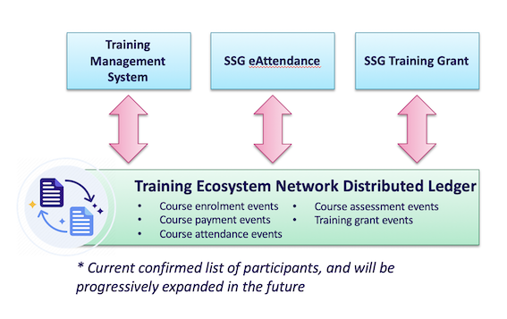
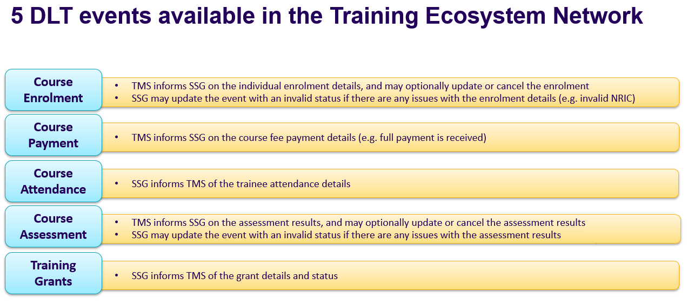
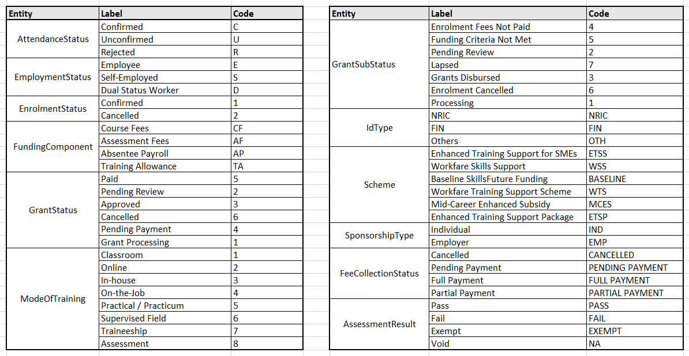

Version 0.3

# SSG Grants Management Specifications 

This document is intended to provide specifications for external users connecting with the SSG Training Ecosystem Distributed Ledger (DL) Network.

# Table of Contents

- [SSG Grants Management Specifications](#SSG-Grants-Management-Specifications)
- [Table of Contents](#Table-of-Contents)
  - [Overview](#Overview)
  - [SSG Training Ecosystem Distributed Ledger Network](#SSG-Training-Ecosystem-Distributed-Ledger-Network)
    - [Grants Management Events](#Grants-Management-Events)
      - [Validation Flow for Grants Management Events](#Validation-Flow-for-Grants-Management-Events)
    - [Records Management](#Records-Management)
    - [Functionalities](#Functionalities)
    - [Onboarding to the SSG Training Ecosystem DL Network](#Onboarding-to-the-SSG-Training-Ecosystem-DL-Network)
  - [Training Grants Data Submission via the DLT](#Training-Grants-Data-Submission-via-the-DLT)
    - [Category 1 Events](#Category-1-Events)
    - [Category 2 Events](#Category-2-Events)

## Overview

 Figure 1 : Overview 

## SSG Training Ecosystem Distributed Ledger Network

The DL is a Training Ecosystem listener that relays data between SSG and external systems. These external systems are expected to write and read training data pertaining to grants application and processing to their respective DL members. 
The DL network will be hosted using the AWS Managed Blockchain service. External participants are encouraged to host their own members and join the SSG Training Ecosystem DL Network to incur the benefits of using a DL. 
The DL will be used for real-time B2B data synchronization in providing updates between various participants. Availability of various systems are decoupled which reduces the risk from a single point-of-failure. 

### Grants Management Events

 Figure 2 : DLT Grants Event Source 

The various Grants Management events schemas are listed below :

Refer to the following event schemas for the input parameters

1. [Enrolment](event-schema/Enrolment.md) 
2. [Fees Collection](event-schema/FeesCollection.md) 
3. [Attendance](event-schema/Attendance.md) 
4. [Assessment](event-schema/Assessment.md) 
5. [Grants](event-schema/Grants.md)

The list of Grants Management codes are shown in the below figure :

 Figure 3 : Grants Management Codes 

> In the future, external users will be provided with the code and description via another sharing mechanism (TBC).

#### Validation Flow for Grants Management Events
SSG performs validation of the requests submitted by External Systems and then updates the result of the validation.
(TBU)

### Records Management

Input to the DL comprises of four parts as mentioned below:

- #### Header 

  The Header consists of fields which are required by the DL to process the payload. 

- #### Payload

  The payload consists of the actual data submitted to SSG; all data within the payload is to be encrypted before writing to the DLT.
  The data in the payload is classified into 5 different schema types for the various Grants Management Events. 

  The detailed structure for the header and payload for the various events is explained under [Grants Management Events](#grants-management-events) section. All the relevant fields are to be captured as a JSON string which is to be provided as input to the DL Interface. The recommended structure will also be hosted on a public repository as a JSON-schema file (location to be confirmed).  

- #### Public Payload
  
  The public payload consists of additional fields which are not encrypted before writing to the DLT.

- #### DLT Data
  
  The DLT data consists of fields updated by the Distributed Ledger. Any values supplied by the source system will not be used.
  
> In the future, the content of the Header and Payload will continue to evolve. Changes will be managed using different versions of the schema, so the correct version of the JSON-schema file used should be captured in the Header.

### Functionalities

Smart contracts in the DL allow users to perform the following actions to write and read data:

> 1. **WRITE** : Writes the event Payload, given the Header and Payload to write
>
> 2. **READ** : Returns the event Payload, given a certain combination of Lookup keys from the Header

### Onboarding to the SSG Training Ecosystem DL Network

 The [Onboarding Instructions](onboarding\SSG_DLT_Onboarding.md) contain the steps to connect to the SSG Training Ecosystem Distributed Ledger Network and integrate with the sample DLT Interface.
 
## Training Grants Data Submission via the DLT
The DLT is a mechanism to submit training grants data to SSG. While using this mode of data submission, some key points are to be noted. Events from the SSG Training Ecosystem DL Network can be broadly classified into two categories:
- **Category 1 - Events that can be written and read via the DL Network**
These are events for which the partners can submit data via the DL Network and read the updated response data from SSG
- **Category 2 - Events that can only be read via the DL Network**
These are events for which the partners can only read data present on the DL Network; they cannot create new events of this type

### Category 1 Events
This category denotes events for which the partners can submit data via the DL Network and read the updated response data from SSG via the same network. 
Samples include Enrolment, Assessment and Fees Collection.

Partners submitting data for this category of events should adhere to the following guidelines:
1. ***Encrypted data submission:*** Data submitted to the DLT cannot be in plain and should be encrypted with the data key obtained from SSG's Key Management API. Any plain data submissions will be rejected by the partner's own DL member and cannot be considered to be successful submissions to SSG.

2. ***Syncing time with SSG:*** Submissions to the DL Network are to contain the source system timestamp. This is the time when the event data is submitted to the DL Network. In order to align with SSG's time, the source system should be in sync with the Amazon Time Sync Service via Network Time Protocol (NTP). If the source system time is not aligned with SSG's time, this could lead to improper sequencing of data updates, which in turn would lead to erroneous data submission via the DLT. 

3. ***Changing validation status:*** Partners cannot change or set the validation result of their submissions; attempts to set the `validationResult` of data submitted to the DL member will be ignored; attempts to update the `validationResult` of SSG's response data will be rejected.

4. ***Successive updates to submitted data:*** Partners can update submitted data for the events in this category (for example, update and cancellation of enrolments, assessments etc). However, it is to be noted that newer updates to a particular record can be done only after receiving the confirmation for the previous update event. Failure to adhere to this would lead to improper sequencing of data updates due to the asynchoronous nature of the data submission process. This in turn would result in SSG potentially dropping some updates and unpredictable state of data submission. To illustrate the expected process of data submission, consider the following sequence for submission of Enrolment data:
   * Partners create a new Enrolment event (record creation) for a given primary key and secondary key; the tertiary key should be set to `-1` for event creation. Once this is submitted, the partner waits for the response from SSG for this event. No new events pertaining to that record are to be submitted in the meantime.
   * SSG validates the submission and if the data is valid, returns the enrolment reference number in the tertiary key.
   * Partners listening for events from the DL Network read this response and extract the tertiary key. For further updates to the data submitted for this enrolment record, partners are expected to include the enrolment reference number as tertiary key along with the primary and secondary keys.
   * If some data fields in the above record are to be modified (record update), partners update the record for the given primary, secondary and tertiary keys; the tertiary key in this case should carry the enrolment reference number. The same applies for cancellation of this particular enrolment record as well.
   * Once this is submitted, the partner waits for the response from SSG for this event. No new events pertaining to that record are to be submitted in the meantime. If another update event (with a different set of changes) is submitted for the same record in the meantime, the order of execution of events cannot be guaranteed, which would lead to unpredictable state of data submission.

### Category 2 Events
This category denotes events the partners can only read data present on the DL Network; they cannot create new events of this type. 
Samples include Attendance and Grants (estimated and disbursed).
Reading these events from the DL Network can be achieved either using DL Listeners or by querying the DL Member.