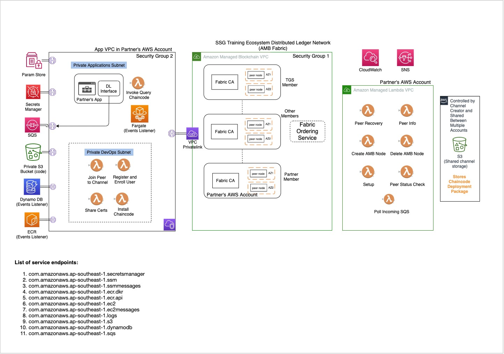
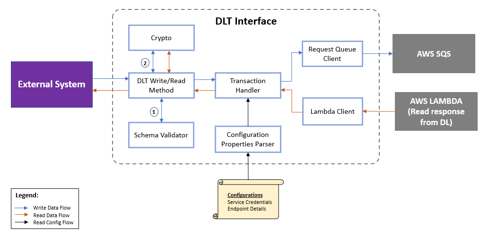
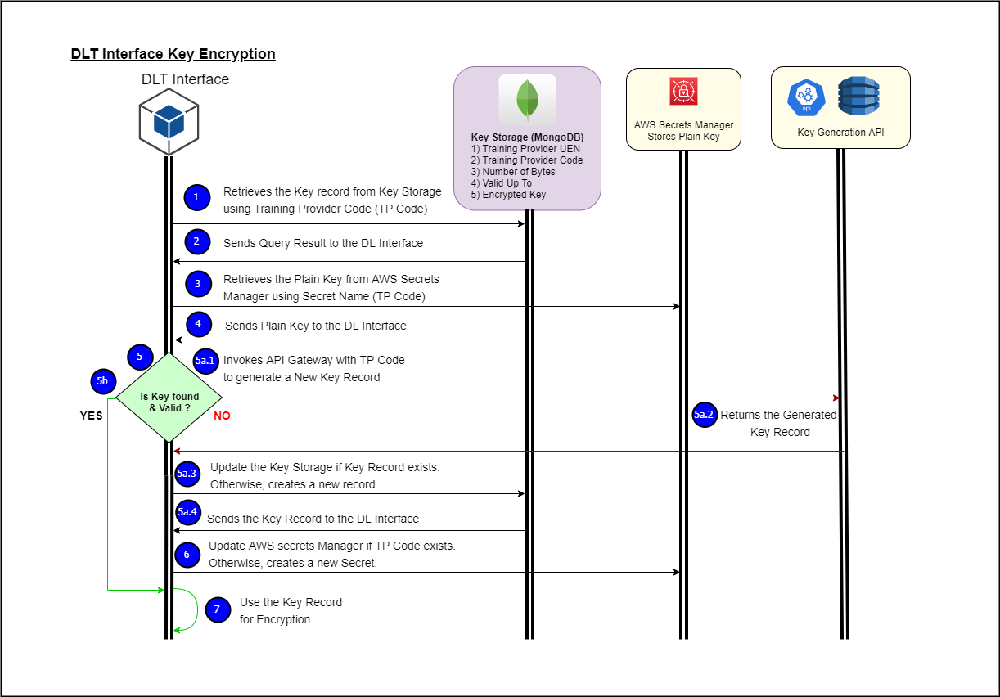
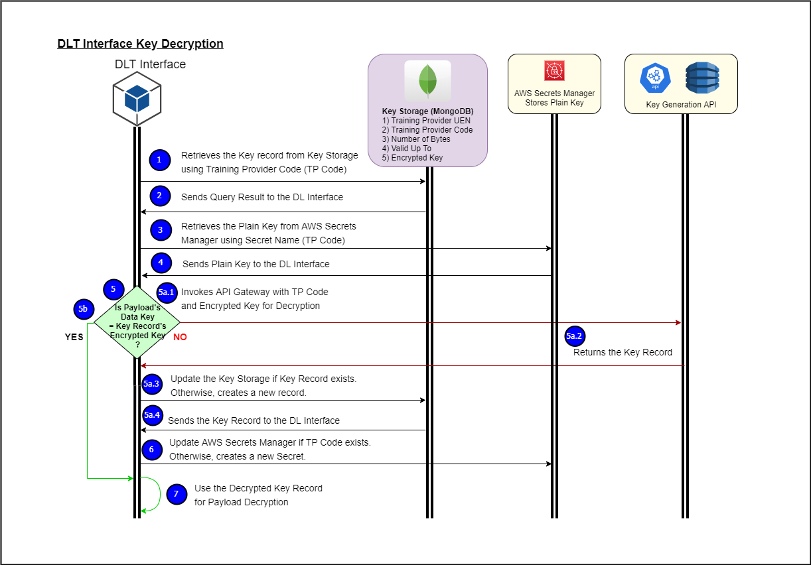
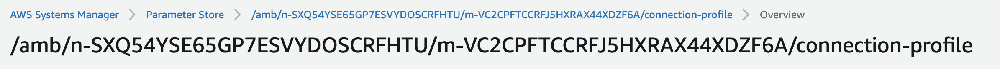

Version 0.5

# Onboarding to the SSG Training Ecosystem DL Network

Onboarding guidelines and software interface specifications for connecting to the SSG Training Ecosystem Distributed Ledger (DL) Network. 

This document is for the partners who intend to connect to the SSG Training Ecosystem DL Network. 

# Table of Contents

- [Onboarding to the SSG Training Ecosystem DL Network](#Onboarding-to-the-SSG-Training-Ecosystem-DL-Network)
- [Table of Contents](#Table-of-Contents)
- [Overview](#Overview)
- [Mandatory Considerations](#Mandatory-Considerations)
		- [Fabric Channels](#Fabric-Channels)
- [Sample Distributed Ledger Architecture](#Sample-Distributed-Ledger-Architecture)
	- [Components Configuration](#Components-Configuration)
		- [List of Lambda functions](#List-of-Lambda-functions)
	- [Setting up the DL Network stack](#Setting-up-the-DL-Network-stack)
		- [**Setting up the DL Member:**](#Setting-up-the-DL-Member)
		- [**Setting up the Apps, DLT operations and Management Components:**](#Setting-up-the-Apps-DLT-operations-and-Management-Components)
	- [Monitoring and Alerts](#Monitoring-and-Alerts)
		- [CloudWatch Alarms](#CloudWatch-Alarms)
		- [Configurations](#Configurations)
	- [Dynamodb Capacity Mode](#Dynamodb-Capacity-Mode)
	- [Distributed Ledger Interface](#Distributed-Ledger-Interface)
		- [Purpose of the Distributed Ledger Interface](#Purpose-of-the-Distributed-Ledger-Interface)
		- [High-Level Design](#High-Level-Design)
		- [Components](#Components)
		- [**Functional Specifications**](#Functional-Specifications)
		- [DLT Return Codes](#DLT-Return-Codes)
		- [Connecting the DL Interface with the DL Network stack](#Connecting-the-DL-Interface-with-the-DL-Network-stack)
		- [External Libraries](#External-Libraries)
	- [Cryptographic Specifications](#Cryptographic-Specifications)
		- [Hashing](#Hashing)
		- [Encryption & Decryption](#Encryption--Decryption)
		- [Key Storage & Handling](#Key-Storage--Handling)
			- [Mandatory Considerations](#Mandatory-Considerations-1)
				- [API Gateway for Key Generation](#API-Gateway-for-Key-Generation)
			- [Recommended Considerations](#Recommended-Considerations)
			- [Data Key Generation:](#Data-Key-Generation)
			- [Data Key Decryption:](#Data-Key-Decryption)
- [Troubleshooting](#Troubleshooting)
	- [SSG DLT Common Encountered Errors](#SSG-DLT-Common-Encountered-Errors)
		- [Errors encountered during debugging the DL Interface](#Errors-encountered-during-debugging-the-DL-Interface)
		- [Errors encountered during Performance Testing](#Errors-encountered-during-Performance-Testing)
	- [Upgrading or Downgrading Peer Nodes](#Upgrading-or-Downgrading-Peer-Nodes)
		- [Change the faulty one and replace with a new peer](#Change-the-faulty-one-and-replace-with-a-new-peer)
		- [Update connection profile](#Update-connection-profile)

# Overview

The DL is a Training Ecosystem listener that relays data between SSG and external systems. The DL will be used for real-time B2B data synchronization in providing updates between various participants. Availability of various systems are decoupled which reduces the risk from a single point-of-failure.  
The DL network will be hosted using the AWS Managed Blockchain service using Hyperledger Fabric. External participants are encouraged to host their own members and join the SSG Training Ecosystem DL Network to incur the benefits of using a DL. 

# Mandatory Considerations

At a high-level, partners would be required to comply with the following steps for connecting and using the DL:

### Fabric Channels

A Hyperledger Fabric Channel can be thought of as a private “subnet” of communication between two or more peers belonging to a specific network members, for the purpose of conducting private and confidential transactions. Peers will receive the blocks with transactions information only if they joined a specific channel.

As per current design, all peers will join the same Training Grants Channel to write and read data to and from the DL. In the future, there could potentially be other channels created for submitting other forms of data.

# Sample Distributed Ledger Architecture	

The diagram shows the typical components required for Partners to connect to their designated DL Member.



<p align="center"> Figure 1 : Distributed Ledger Architecture for Partners</p>

This is a sample architecture for connecting to the SSG Training Ecosystem DL Network using AWS Lambda functions. The sample DL Interface implementation to support this stack has also been provided along with the recommended configuration for the components. The same can be achieved in other ways and partners are free to explore other options for connectivity to the DL.

The sample architecture has 4 parts:

1. **SSG Training Ecosystem Distributed Ledger Network** - hosted on AWS Managed Blockchain using Hyperledger Fabric v1.2. Partners are encoraged to join this network by hosting members with one or more peer nodes
2. **App components** - act as client to the SSG Training Ecosystem DL Network and allow reading and writing data to the DL members
3. **DLT Operations components** - provide for supporting tasks that allow interacting with the DL member to enable the Apps functionalities
4. **Management components** - provide the monitoring and management functions to monitor the DL member and other components


## Components Configuration

| Components                      |           Config            |
| ------------------------------- | :-------------------------: |
| Lambda                          | See the List of Lambda functions table |
| AWS Managed Blockchain - Member |      Standard Edition, Peer instance size at least bc.t3.xlarge       |
| AWS Secrets Manager             |                             |
| AWS Parameter Store             |                             |
| AWS Simple Queue Service        |       Standard Queue        |

### List of Lambda functions
> Note: The configurations below are recommendations and may be altered depending on the memory usage and timeout analysis of the lambda functions.

| Lambda Name                          | Description                                                                                                                          | Memory Size (MB) | Timeout (s) |
|--------------------------------------|--------------------------------------------------------------------------------------------------------------------------------------|------------------|-------------|
| <YOUR_PREFIX>-invoke-query-chaincode | Lambda function that allows to invoke or query any function of the chaincode on a certain channel using identity of a required user. | 512              | 300         |
| <YOUR_PREFIX>-invoke-poll-sqs        | Lambda function that triggers the Invoke/Query lambda when a message is written to the Incoming SQS queue.                           | 320              | 320          |
| <YOUR_PREFIX>-share-certs            | Lambda function for the new channel member to share certificates that needs to be added to the channel configuration.                | 192              | 10          |
| <YOUR_PREFIX>-join-channels          | Lambda function to join peers to channels                                                                                            | 192              | 10          |
| <YOUR_PREFIX>-register-enroll-user   | Lambda function to register and enroll new users                                                                                     | 192              | 10          |
| <YOUR_PREFIX>-install-chaincode      | Lambda function that helps to install chaincode                                                                                      | 192              | 10          |
| <YOUR_PREFIX>-get-channel-config     | Lambda function to retrieve details of Hyperledger Fabric channel configuration                                                      | 256              | 300         |
| <YOUR_PREFIX>-peer-recovery          | Lambda function to coordinate peer recovery process                                                                                  | 256              | 900         |
| <YOUR_PREFIX>-create-amb-node        | Lambda function creating a Fabric peer in the AMB network                                                                            | 256              | 360         |
| <YOUR_PREFIX>-delete-amb-node        | Lambda function deleting a Fabric peer from the AMB network                                                                          | 256              | 360         |
| <YOUR_PREFIX>-setup                  | Lambda function to set up environment for the rest of the applications. Creates Connection Profile, enrolls Admin User.              | 192              | 20          |
| <YOUR_PREFIX>-peer-status-check      | Lambda function to test the status of the peer                                                                                       | 192              | 10          |
| <YOUR_PREFIX>-peer-info              | Lambda function displaying peer configuration, joined channels and installed chaincodes                                              | 192              | 15          |

## Setting up the DL Network stack

### **Setting up the DL Member:**

1. #### **Generate AWS account Access key ID and Secret key**

   Access keys are required in order to make programmatic calls to AWS API operations (ex. AWS Lambda) and use the AWS CLI. It consists of two parts (Access key ID and Secret key).

   Refer to the link below for guidelines to create the Access key pair:
   https://docs.aws.amazon.com/IAM/latest/UserGuide/id_credentials_access-keys.html

   The Access key pair information is to be updated in the sample DL Interface Config file.

2. #### **Accept the invite and join the SSG Training Ecosystem DL Network**

   2.1. **Creating a DL member**

   The external user has to be invited by SSG in order to join the SSG Training Ecosystem DL Network. This user will receive an Invitation to its AWS account with an Invitation ID. To join the network, the user must accept the Invitation and create a member using the Invitation ID. 

   For more information on creating a member using the Invitation, refer to this link: https://docs.aws.amazon.com/managed-blockchain/latest/managementguide/managed-blockchain-hyperledger-member.html

   The DL member ID is to be updated in the sample DL Interface Config file.

   2.2. **Creating a peer node within the member**

   A newly created member has no default peer nodes. In order for a member to actively participate in the network, it needs to have at least one peer node. The peer node will interact with the network in performing transactions such as writing and reading training data. For high availability, it is recommended to host at least 2 peer nodes. The maximum number of peer nodes is capped at 3, for now.

   For more information on creating the peer node, refer to this link: https://docs.aws.amazon.com/managed-blockchain/latest/managementguide/managed-blockchain-hyperledger-peer-nodes.html

   The peer node ID is to be updated in the sample DL Interface Config file.

> *Steps 1 and 2 are mandatory to connect to the DL Network*

### **Setting up the Apps, DLT operations and Management Components:**

3. Follow the instructions under the `Readme` files located within the following repositories in the same order:

   * `partners-dlt-refarch-amb-fabric-config` (Includes the steps to setup all the components)
   * `partners-dlt-refarch-amb-fabric-devops` (Includes the steps to onboard to SSG's Training Ecosystem Network)
   * `partners-dlt-refarch-amb-fabric-apps` (Includes the steps to write to SSG's Training Ecosystem Network)
   
   The code for all these functions are distributed under Apache 2.0 license.

   Upon successful completion, the partner should be able to write data via the Incoming SQS and see it reflected on the blockchain network.

   The Incoming SQS Endpoint from the above step is to be updated in the sample DL Interface Config file to allow connecting with the DL Interface.
  

After completing the above steps successfully, the Partners are ready to interact with the distributed ledger. These steps are linked to the sample architecture presented under [Recommended Distributed Ledger Architecture](#recommended-distributed-ledger-architecture). Partners are free to replace the relevant scripts with their custom implementations to achieve the same effect.


## Monitoring and Alerts

### CloudWatch Alarms

The stack comes with the following custom defined metrics which trigger alarms for the types of issues below.

| S.No. | CloudWatch Alarm          | Issue                        | Root Cause                                                                                                                                      | Handling                                                                                           |
|-------|--------------------|------------------------------|-------------------------------------------------------------------------------------------------------------------------------------------------|----------------------------------------------------------------------------------------------------|
| 1     | Invalid DLT Record | Invalid records              | Chaincode errors(wrong channel name, wrong event type), <br> Incorrect JSON format(missing primary key, missing secondary key, missing payload) | Raise Invalid Record alarm <br> Push record to DLQ (Dead Letter Queue) for post-analysis <br> Drop the record          |
| 2     | DLT Retry          | Blockchain peer node failure | Any peer in the network is down which increases latency.                                                                                        | Re-try the records which bounced <br> Raise alarm once the number of retries crosses the threshold |

### Configurations

Below are the CloudWatch Alarm configurations required for the monitoring setup. (Please see in setConfigVariable.sh):

1. SNS Error Topic Name: AMB_APPS_SNS_PROCESSING_ERROR_TOPIC_NAME=<YOUR_PREFIX>-Amb-ambprocesserror
2. SNS Notification Email Recipient: AMB_APPS_SNS_PROCESSING_ERROR_NOTIFICATION_EMAIL=<YOUR_EMAIL> 
   > An email confirmation for the subscription would be sent to this address. The subcription has to be confirmed first in order to receive the notification alerts.
3. Alarm for Invalid DLT Record: AMB_APPS_INVALID_RECORD_CW_ALARM_INVALID_REC=Cwa-<YOUR_PREFIX>-InvalidDltRecord
4. Alarm for Retry: AMB_APPS_INVALID_RECORD_CW_ALARM_RETRY=Cwa-<YOUR_PREFIX>-DltRetry
5. CloudWatch Alarm Namespace: AMB_APPS_INVALID_RECORD_CW_NAMESPACE="custom/DltRecords"
6. CloudWatch Metric Name: AMB_APPS_INVALID_RECORD_CW_METRIC="Metric-<YOUR_PREFIX>-DltRecords"

## Dynamodb Capacity Mode

On demand capacity is recommended until the application traffic is predictable.


## Distributed Ledger Interface 

### Purpose of the Distributed Ledger Interface

In order to facilitate integration with the DL Member and allied components, a sample implementation of a Distributed Ledger Interface has been provided. This allows partners to integrate their services with their respective DL member. The Interface supports both Java and .NET framework.

**Interface for .NET** **:** compatible with .NET Framework version 4.6.1

**Interface for Java :** compatible with Java 8 version.

### High-Level Design



<p align="center"> Figure 2 : High-Level Design</p>

### Components

The Distributed Ledger Interface comprises of the following components:

1. **Main Components:**
   These are the key components that enable connectivity of the external system with their respective DL member. This module is further comprised of:
    - **DL Read/Write Method:** includes functions that are exposed to external systems
    - **Transaction Handler:** packages input to the Request Queue Client and Lambda Client
    - **Configuration Properties Parser:** loads and parses the properties from the configuration file
    - **Request Queue Client:** interfaces with the AWS Simple Queue Service (SQS)
    - **Lambda Client:** interfaces with the AWS Lambda function to read from the DL

2. **Utility Components:**
   This is the utility function for the above components:<br>
    - **Schema Validator:** validates the input based on the corresponding JSON schema
    - **Crypto:** handles key management for encryption decryption; also generates hash of selected fields and encrypts/decrypts the relevant parts of the data


###  **Functional Specifications**

   This section defines the function names exposed by the Grants DL Interface to write and read data to and from the DL.

   1. **writeGrantsDataDLT** – Writes the grants data asynchronously to the AWS SQS.

      `writeGrantsDataDLT(string requestData);`  

      **Input Request Parameters** :<br>
       Refer to the following event schemas for the input parameters
       1. [Enrolment](../event-schema/Enrolment.md)
       2. [Fees Collection](../event-schema/FeesCollection.md)
       3. [Attendance](../event-schema/Attendance.md)
       4. [Assessment](../event-schema/Assessment.md)
       5. [Grants](../event-schema/Grants.md)
         

2. **readGrantsDataDLT** - Returns data queried from the DL, based on the lookup keys.

   `string response = readGrantsDataDLT(string requestData);`

   **Input Request Parameters** :

   **Header** : consists of fields required by the DL Interface to read from the Distributed Ledger. 

   | Attributes   | Data Type | Description                                                  |
   | ------------ | --------- | ------------------------------------------------------------ |
   | eventType    | String    | Type of the event <br>(Enrolment, FeesCollection, Attendance, Assessment, Grants) |
   | primaryKey   | String    | Primary Lookup Key<br>CONCAT(Course Reference Number,Trainee ID) |
   | secondaryKey | String    | Secondary Lookup Key<br>(Course Run ID)                      |
   | tertiaryKey  | String    | Tertiary Lookup Key <br>For Attendance Event: Course Session ID<br />For Assessment Event: Assessment Number<br>For Grants Event: Grant Number<br>For Enrolment and Fees Collection Events: -1 |
   | pageNumber   | String    | Page Number<br>Each page consists of a maximum of 10 records<br>If this field is empty, the function returns the records from the first page |  

   The DLT performs partial queries based on the lookup keys inside the Header. Some of the considerations to perform partial queries are:

- The input JSON for the read operation should follow the ordering of the lookup keys, i.e., eventType followed by primaryKey, secondaryKey and tertiaryKey
- Each Page size is set to a maximum of 10 records
- The pageNumber field is to be set accordingly to query multiple records
- If pageNumber is empty, the function will always return the records from the first page
- The field named eventType is mandatory for querying data
- For the fields that need not to be queried in the DL should be kept as an empty string

> The data submitted by partners for create action with tertiarykey "-1" will be validated by TGS, 
if the validation is successful with "TGS-200", TGS will respond back with Reference Number set in the tertiarykey. 
In this case, when the record is Valid, partners will need to query with tertiaryKey as empty string rather that "-1" which was set at the time of submission. 
Please refer to the sample below for input :

```
"{
		"header":
		{
			"eventType": "Enrolment",
			"primaryKey": "TGS-0026008-ESS0118316H",
			"secondaryKey": "10026",
			"tertiaryKey": "",
			"pageNumber":"1"
		}
}"
```

  **Examples:**

> Sample Request and Response will be in Serialized JSON Object format

   **Scenario 1 - Read multiple records**: <br>
	 Query the enrolments for a specific course reference number, page-by-page. We assume that there are 2 enrolment records matching the given query parameters.

  **<u>Sample Request</u>**

  The sample request is populated with values for eventType while all the other keys are empty strings as shown below:

```
"{
	"header":
	{
		"eventType": "Enrolment",
		"primaryKey": "",
		"secondaryKey": "",
		"tertiaryKey": "",
		"pageNumber":"1"
	}
}"																									
```
  **<u>Sample Response</u>** <br>
	The sample response is shown below:

```
"{
	"page": "1",
	"totalRecords": "2",
	"data": [{
			"header": {
				"eventType": "Enrolment",
				"primaryKey": "80e00f124e8bd67257fd0291a8491c3b2ce3ee838ff9dafd91a841da0f7c329174eaaa0006e289e5536f46d0529be058",
				"secondaryKey": "10026",
				"tertiaryKey": "-1",
				"trainingPartnerUEN": "T08GB0032G",
				"trainingPartnerCode": "T08GB0032G-01",
				"schemaLocation": "<TBC>",
				"schemaVersion": "TGS_v1.0"
			},
			"payload": {
				"action": "create",
				"trainingPartner": {
					"code": "T08GB0032G-01",
					"uen": "T08GB0032G"
				},
				"course": {
					"referenceNumber": "TGS-0026008-ES",
					"run": {
						"id": "10026"
					}
				},
				"trainee": {
					"id": "S0118316H",
					"idType": {
						"type": "NRIC"
					},
					"dateOfBirth": "1950-10-16",
					"fullName": "Jon Chua",
					"contactNumber": {
						"countryCode": "+60",
						"areaCode": "00",
						"phone": "88881234"
					},
					"emailAddress": "abc@abc.com",
					"sponsorshipType": "EMPLOYER",
					"employer": {
						"uen": "G01234567S",
						"contact": {
							"fullName": "Stephen Chua",
							"contactNumber": {
								"countryCode": "+60",
								"areaCode": "00",
								"phoneNumber": "88881234"
							},
							"emailAddress": "x@test.com"
						}
					},
					"enrolmentDate": "2020-05-01"
				}
			},
			"publicPayload": {
				"tags": ["TBC"],
				"source": {
					"dateTime": "2020-05-04 20:58:17",
					"timeStampInMilliSeconds": "1588597097880"
				},
				"ack": {
					"dateTime": "-1",
					"timeStampInMilliSeconds": "-1"
				}
			},
			"dltData": {
				"eventSource": "<SSG's DLT Member>",
				"timeStamp": "2020-05-04T20:58:38.251Z",
				"validationResult": "TGS-300"
			}
		},
		{
			"header": {
				"eventType": "Enrolment",
				"primaryKey": "dc4d6aac027a5b3eb5818b5a7405b53fbdd1da45d8129bfe8b2482e0e6a0620130b20722fbec681498021bf1b4d4fe26",
				"secondaryKey": "10026",
				"tertiaryKey": "-1",
				"trainingPartnerUEN": "T08GB0032G",
				"trainingPartnerCode": "T08GB0032G-01",
				"schemaLocation": "<TBC>",
				"schemaVersion": "TGS_v1.0"
			},
			"payload": {
				"action": "create",
				"trainingPartner": {
					"code": "T08GB0032G-01",
					"uen": "T08GB0032G"
				},
				"course": {
					"referenceNumber": "TGS-0026008-ES",
					"run": {
						"id": "10026"
					}
				},
				"trainee": {
					"id": "S0115686H",
					"idType": {
						"type": "NRIC"
					},
					"dateOfBirth": "1951-01-04",
					"fullName": "John Smith",
					"contactNumber": {
						"countryCode": "+60",
						"areaCode": "00",
						"phone": "98087654"
					},
					"emailAddress": "abc@abc.com",
					"sponsorshipType": "EMPLOYER",
					"employer": {
						"uen": "G01234567S",
						"contact": {
							"fullName": "Stephen Chua",
							"contactNumber": {
								"countryCode": "+60",
								"areaCode": "00",
								"phoneNumber": "88881234"
							},
							"emailAddress": "x@test.com"
						}
					},
					"enrolmentDate": "2020-05-01",
					"fees": {
						"discountAmount": "50.00",
						"currencyType": "SGD"
					}
				}
			},
			"publicPayload": {
				"tags": ["TBC"],
				"source": {
					"dateTime": "2020-05-04 20:58:17",
					"timeStampInMilliSeconds": "1588597097880"
				},
				"ack": {
					"dateTime": "-1",
					"timeStampInMilliSeconds": "-1"
				}
			},
			"dltData": {
				"eventSource": "<SSG's DLT Member>",
				"timeStamp": "2020-05-04T20:58:38.251Z",
				"validationResult": "TGS-300"
			}
		}
	]
}"																									
```

  **Scenario 2 - Read a single record**: <br>
	Query a specific enrolment record associated with a certain course reference number, trainee ID, course run id and tertiary key. We assume that there is only one record matching the given query parameters.


  **<u>Sample Request</u>** <br>
	The sample request is populated with values for eventType, primaryKey, secondaryKey and tertiaryKey as shown below: 
```
"{
		"header":
		{
			"eventType": "Enrolment",
			"primaryKey": "TGS-0026008-ESS0118316H",
			"secondaryKey": "10026",
			"tertiaryKey": "ENR-1912-000123",
			"pageNumber":"1"
		}
}"
```

  **<u>Sample Response</u>** <br>
  The sample response is shown below:
```
"{
	"page": "1",
	"totalRecords": "1",
	"data": [{
		"header": {
			"eventType": "Enrolment",
			"primaryKey": "80e00f124e8bd67257fd0291a8491c3b2ce3ee838ff9dafd91a841da0f7c329174eaaa0006e289e5536f46d0529be058",
			"secondaryKey": "10026",
			"tertiaryKey": "ENR-1912-000123",
			"trainingPartnerUEN": "T08GB0032G",
			"trainingPartnerCode": "T08GB0032G-01",
			"schemaLocation": "<TBC>",
			"schemaVersion": "TGS_v1.0"
		},
		"payload": {
			"action": "create",
			"trainingPartner": {
				"code": "T08GB0032G-01",
				"uen": "T08GB0032G"
			},
			"course": {
				"referenceNumber": "TGS-0026008-ES",
				"run": {
					"id": "10026"
				}
			},
			"trainee": {
				"id": "S0118316H",
				"idType": {
					"type": "NRIC"
				},
				"dateOfBirth": "1950-10-16",
				"fullName": "Jon Chua",
				"contactNumber": {
					"countryCode": "+60",
					"areaCode": "00",
					"phone": "88881234"
				},
				"emailAddress": "abc@abc.com",
				"sponsorshipType": "EMPLOYER",
				"employer": {
					"uen": "G01234567S",
					"contact": {
						"fullName": "Stephen Chua",
						"contactNumber": {
							"countryCode": "+60",
							"areaCode": "00",
							"phoneNumber": "88881234"
						},
						"emailAddress": "x@test.com"
					}
				},
				"enrolmentDate": "2020-05-01",
                "fees": {
                    "discountAmount": "50.00",
                    "currencyType": "SGD"
                },
               "referenceNumber":"ENR-1912-000123"
			}
		},
		"publicPayload": {
			"tags": ["TBC"],
			"source": {
				"dateTime": "2020-05-04 20:58:17",
				"timeStampInMilliSeconds": "1588597097880"
			},
			"ack": {
				"dateTime": "-1",
				"timeStampInMilliSeconds": "-1"
			}
		},
		"dltData": {
			"eventSource": "<SSG's DLT Member>",
			"timeStamp": "2020-05-04T20:58:38.251Z",
			"validationResult": "TGS-200"
		}
	}]
}"
```

  **Scenario 3 - Invalid Lookup Key**: <br>
	Query the enrolment record for a given Trainee ID, without specifying the other keys.

  **<u>Sample Request</u>**<br>
  The sample request is populated with eventType and secondaryKey only as shown below:

```
"{
	"header":
	{
		"eventType": "Enrolment",
		"primaryKey": "",
		"secondaryKey": "10026",
		"tertiaryKey": "",
		"pageNumber":"1"
	}
}"
```

  **<u>Sample Response</u>**

  The response is an empty data object as shown below:

```
{
	"page": "1",
	"totalRecords": "0",
	"data": []
}
```

The reason the above query does not produce any records is because all keys until secondaryKey have not been populated. The corresponding valid sample request for the same query is shown below:

```
"{
	"header":
	{
		"eventType": "Enrolment",
		"primaryKey": "TGS-0026008-ESS0118316H",
		"secondaryKey": "10026",
		"tertiaryKey": "",
		"pageNumber":"1"
	}
}"
```

### DLT Return Codes

After writing a transaction to the DL, TGS validates the data and returns the validation with a result code.
This result code is reflected in the `validationResult` field when partners read the written transaction.

Below API returns the list and details of DLT return codes.

 API Name                                        | Endpoint Display Name        | Endpoint Path              | HTTP Method | API Endpoint DescriptionÔøΩ                         |
|-------------------------------------------------|------------------------------|----------------------------|-------------|---------------------------------------------------|
| Get the description of the given response code | Get DLT return code details | <environment_url>/dlt/trainingNetwork/codes | GET         | This API used to get the DLT return code details. |

### Connecting the DL Interface with the DL Network stack
The links below point to documents with detailed steps showing how partners could connect their infra stack with the sample DL Interface implementation, in order to write and read to and from SSG's DL Network.

- [Connect to DL Network stack via .NET DL Interface](../refs/Partners_DLT_Infra_Connectivity_Guide_.NET_DLInterface.pdf)
- [Connect to DL Network stack via Java DL Interface](../refs/Partners_DLT_Infra_Connectivity_Guide_Java_DLInterface.pdf)

### External Libraries

The list of external libraries used by .NET and Java DL Interfaces are :

**.NET DL Interface  :**

.NET Version: 4.6.1
IDE: Visual Studio Code

| Num  | Library                                   | Version    | Function                                                     |
| ---- | ----------------------------------------- | ---------- | ------------------------------------------------------------ |
| 1.   | AWSSDK.Core                               | 3.3.104.27 | Provides  API core dependency for AWS Services (Lambda, SQS) |
| 2.   | AWSSDK.Lambda                             | 3.3.108    | Provides  .NET API for AWS Lambda                            |
| 3.   | AWSSDK.SQS                                | 3.3.102.66 | Provides  .NET API for AWS SQS                               |
| 4.   | System.Configuration.ConfigurationManager | 4.7.0      | Provides  XML Parser used parsing configuration files        |
| 5.   | Newtonsoft.Json                           | 12.0.3     | Provides  conversion between JSON content and Class Objects.<br> Provides functionalities to validation JSON schema |
| 6.   | BouncyCastle                              | 1.8.5      | Used for hashing and encryption/decryption operations        |
| 7.   | MongoDB.Driver                            | 2.3.0      | Provides functionalities to interact with MongoDB |

**Java DL Interface :**

Java Version: 1.8.0_231
Maven Version: 3.6.3
IDE: Eclipse minimum version 4.6

| Num  | Library          | Version  | Function                                                     |
| ---- | ---------------- | -------- | ------------------------------------------------------------ |
| 1.   | aws-java-sdk     | 1.11.723 | Provides  Java API for AWS Amazon's infrastructure web  services (Lambda, SQS) |
| 2.   | jackson-databind | 2.9.8    | Provides  conversion between JSON content and Java Objects   |
| 3.   | snakeyaml        | 1.21     | Provides  YAML Parser used for parsing configuration files   |
| 4.   | log4j-api, log4j-core | 2.6.1    | Provides  logging utility                                    |
| 5.   | bouncy castle : bcprov-jdk15on   | 1.64     | Used for hashing and encryption/decryption operations        |
| 6.   | org.everit.json.schema  | 1.3.0    | Provides functionalities to validation JSON schema           |
| 7.   | commons-lang3  | 3.9   | Provides functionalities for String validation           |
| 8.   | mongo-java-driver  | 3.12.2    | Provides functionalities to interact with MongoDB           |

> The sample DL Interface has been tested against the above-mentioned libraries and packages with the specified version numbers.
Partners are expected to maintain any patching or upgrades to these libraries and changes resulting because of these patches to the DL Interface. 

## Cryptographic Specifications

The following cryptographic operations are required to be used while writing and reading data to and from the DL:

1. Hashing of lookup keys - PII used as identifiers to lookup data are to be hashed before writing to the DL
2. Encryption of payload - the payload is to be encrypted before writing to the DL
3. Decryption of payload - the payload is to be decrypted after reading from the DL
4. Key Storage & Handling - securely store the plain and encrypted keys and refresh them upon expiry

The DL Interface Utility component for Cryptographic operations provides a sample implementation of these operations.

### Hashing

The algorithm to be used for hashing is SHA3-384 with 48 bytes output. It is mandatory to submit hash of the primary key, since they are composed of PII. The sample method to generate a hash of the primary lookup key is shown below:

**Generation of Primary Key**

    Course Reference Number : "TGS-0026008-ES"
    
    Trainee ID : "S0118316H"
    
    Primary Lookup Key : 
    SHA3-384(CONCAT(TGS-0026008-ES,S0118316H)) = SHA3-384(TGS-0026008-ESS0118316H) = 80e00f124e8bd67257fd0291a8491c3b2ce3ee838ff9dafd91a841da0f7c329174eaaa0006e289e5536f46d0529be058

The sample request after Hashing is shown below:

```
"{
	"header": {
		"eventType": "Enrolment",
		"primaryKey": "80e00f124e8bd67257fd0291a8491c3b2ce3ee838ff9dafd91a841da0f7c329174eaaa0006e289e5536f46d0529be058",
		"secondaryKey": "10026",
		"tertiaryKey": "-1",
		"trainingPartnerUEN": "T08GB0032G",
		"trainingPartnerCode": "T08GB0032G-01",
		"schemaLocation": "<TBC>",
		"schemaVersion": "TGS_v1.0"
	},
	"payload": {
		"action": "create",
		"trainingPartner": {
			"code": "T08GB0032G-01",
			"uen": "T08GB0032G"
		},
		"course": {
			"referenceNumber": "TGS-0026008-ES",
			"run": {
				"id": "10026"
			}
		},
		"trainee": {
			"id": "S0118316H",
			"idType": {
				"type": "NRIC"
			},
			"dateOfBirth": "1950-10-16",
			"fullName": "Jon Chua",
			"contactNumber": {
				"countryCode": "+60",
				"areaCode": "00",
				"phone": "88881234"
			},
			"emailAddress": "abc@abc.com",
			"sponsorshipType": "EMPLOYER",
			"employer": {
				"uen": "G01234567S",
				"contact": {
					"fullName": "Stephen Chua",
					"contactNumber": {
						"countryCode": "+60",
						"areaCode": "00",
						"phoneNumber": "88881234"
					},
					"emailAddress": "x@test.com"
				}
			},
			"enrolmentDate": "2020-05-01",
			"fees": {
			    "discountAmount": "50.00",
			    "currencyType": "SGD"
			}
		}
	},
	"publicPayload": {
		"tags": ["TBC"],
		"source": {
			"dateTime": "2020-05-04 20:58:17",
			"timeStampInMilliSeconds": "1588597097880"
		},
		"ack": {
			"dateTime": "-1",
			"timeStampInMilliSeconds": "-1"
		}
	},
	"dltData": {
		"eventSource": "",
		"timeStamp": "",
		"validationResult": ""
	}
}"
```

### Encryption & Decryption

The algorithm to be used for encryption/decryption is AES-256 (key size is 256-bits). The payload containing sensitive data along with PII is to be encrypted before storing on the DLT. <br>
The encrypted record is stored along with the encrypted data key; the corresponding plain key is used to encrypt the record.  
It is mandatory to submit the encrypted payload along with the encrypted data key to the DLT.

Sample values for the encrypted payload are shown below:

```
"{
	"header": {
		"eventType": "Enrolment",
		"primaryKey": "80e00f124e8bd67257fd0291a8491c3b2ce3ee838ff9dafd91a841da0f7c329174eaaa0006e289e5536f46d0529be058",
		"secondaryKey": "10026",
		"tertiaryKey": "-1",
		"trainingPartnerUEN": "T08GB0032G",
		"trainingPartnerCode":"T08GB0032G-01",
		"schemaLocation": "<TBC>",
		"schemaVersion": "TGS_v1.0"
	},
	"payload": {
		"dataKey": "AQIDAHgcAqmZ5TqTfL2g5+341y+sSnfED8aFMeQky6qb0YqIzgG1CueMB7x+eOqGIoibNkRqAAAAfjB8BgkqhkiG9w0BBwagbzBtAgEAMGgGCSqGSIb3DQEHATAeBglghkgBZQMEAS4wEQQM0FOXFlt0a2Koy69sAgEQgDubdxinNDU/OCGO9w3NdymFrktMs5oQRrO0AwH2ulFD7GPvHz5Yu4j/3vAesYUa3XaElRDmta3gAvmemg==",
		"iv": "NfNZFpU5w+N4ox/SOzre/Q==",
		"record": "PVuY4ymF5vL3pEXnVIbEqbT4iARX1LnjdBli8zkeQcD6fmIDrhbO6DhUhIj2GJC7P70tJR8hsWTSUc4KAva+04a/B9SxVZK2i9nA9Lo/AFeDJlAhvMt83gl36IhlWYTt+dape+1jGCsEz8n/CwB2qH6vGEJO5bu55Pb7YAXhc5QXu8hE72uX76T4tu1+jB8t00DhH/tFZq9ezruXLMHLX1vyvk5ibSzMeFBGWnivdBIHskkTpUSnDAXVKa8iBO+rV2nE73B3k4xdYEdB48I7U8d8bKkeKKjNdQkbFNfSonFPoT7mMh50gf1sbs8oN4nA6qUh/O6lk3l4IWJJUllLEKmuTPTgA/JtdEXr5Uz1QcdSvqVyl6yrH1dRBDubtdvrxSHLnEIV06tfFxA9GOOXYBrz6aO+xd+mTF7q645zDH4pBgT6nkoCy9OVnex8V7kWxqqkw266+hOwKLJuUZFg2AEIIGsbvmuU9I6dBgUppNJTlbbEhgV7kiS9o1b45hS8gkB6hbZsxHHAwUfJx33lgefASVlo6imH6K/Ufza2reCyxqq7w+KEEqj2Hs/i1njlMV0Qnu5HC28ecXqGTjvzA951IhTfIIumhFV5UohaHR16eNxmZ6jjrb89DbI9PnTxUXgLxOHGfwUvEb4nzMdexv9fVlgXfw4RmAOqXq/srKszHPgzNcJDL8Uvw2CK0SsUtLr0RkykVJdzxYxWvp+Y1iaKIU9sNTwFV5RlE1mihgKbzcE+5RwYRx6OnsdC7zDxHLVf/9AyF8Y2gRlGQGYkzfv0eSNUGXftbr9ij6iP7BZdA9YT8Cux24CQAZwf46/D2xveucETTM/sblpMKUmppa0HHXhclK152aNElxj+96YmB2RmH2hyI+5QO9vtT6ApJzQmZPnRA5r5z6CWx6ZNbQ=="
	},
	"publicPayload": {
		"tags": ["TBC"],
		"source": {
			"dateTime": "2020-05-04 20:58:17",
			"timeStampInMilliSeconds": "1588597097880"
		},
		"ack": {
			"dateTime": "-1",
			"timeStampInMilliSeconds": "-1"
		}
	},
	"dltData": {
		"eventSource": "",
		"timeStamp": "",
		"validationResult": ""
	}
}"
```

Reads to the DLT return encrypted records; the DL interface decrypts these records with the corresponding data key.
The sample value for the decrypted payload is shown below:

```
"{
	"page": "1",
	"totalRecords": "1",
	"data": [{
		"header": {
			"eventType": "Enrolment",
			"primaryKey": "80e00f124e8bd67257fd0291a8491c3b2ce3ee838ff9dafd91a841da0f7c329174eaaa0006e289e5536f46d0529be058",
			"secondaryKey": "10026",
			"tertiaryKey": "-1",
			"trainingPartnerUEN": "T08GB0032G",
			"trainingPartnerCode": "T08GB0032G-01",
			"schemaLocation": "<TBC>",
			"schemaVersion": "TGS_v1.0"
		},
		"payload": {
			"action": "create",
			"trainingPartner": {
				"code": "T08GB0032G-01",
				"uen": "T08GB0032G"
			},
			"course": {
				"referenceNumber": "TGS-0026008-ES",
				"run": {
					"id": "10026"
				}
			},
			"trainee": {
				"id": "S0118316H",
				"idType": {
					"type": "NRIC"
				},
				"dateOfBirth": "1950-10-16",
				"fullName": "Jon Chua",
				"contactNumber": {
					"countryCode": "+60",
					"areaCode": "00",
					"phone": "88881234"
				},
				"emailAddress": "abc@abc.com",
				"sponsorshipType": "EMPLOYER",
				"employer": {
					"uen": "G01234567S",
					"contact": {
						"fullName": "Stephen Chua",
						"contactNumber": {
							"countryCode": "+60",
							"areaCode": "00",
							"phoneNumber": "88881234"
						},
						"emailAddress": "x@test.com"
					}
				},
				"enrolmentDate": "2020-05-01",
				"fees": {
				    "discountAmount": "50.00",
				    "currencyType": "SGD"
				}
			}
		},
		"publicPayload": {
			"tags": ["TBC"],
			"source": {
				"dateTime": "2020-05-04 20:58:17",
				"timeStampInMilliSeconds": "1588597097880"
			},
			"ack": {
				"dateTime": "-1",
				"timeStampInMilliSeconds": "-1"
			}
		},
		"dltData": {
			"eventSource": "<SSG's DLT Member>",
			"timeStamp": "2020-05-04T20:58:38.251Z",
			"validationResult": "TGS-300"
		}
	}]
}"
```

### Key Storage & Handling

#### Mandatory Considerations
It is a mandatory to invoke the API Gateway for Key Generation. The response of the API Gateway will return a new key along with the new validity date. This key will be valid for a certain duration of time indicated by the returned validity date. Partners are required to refresh the key once the key expires. Failure to do so would lead to errors in data submissions via the DLT. 

##### API Gateway for Key Generation
Below API endpoints are used for Key Generation and decryption

 API Name                    | Endpoint Display Name  | Endpoint Path                        | HTTP Method | API Endpoint Description                                                         |
|-----------------------------|------------------------|--------------------------------------|-------------|-----------------------------------------------------------------------------------|
| Get DLT Data Encryption Key | Get DLT encryption key | <environment_url>/dlt/trainingNetwork/keys/encryption | POST        | This API used to get the key for encrypting the payload before writing into DLT. |
| Get DLT Data Decryption Key | Get DLT decryption key | <environment_url>/dlt/trainingNetwork/keys/decryption | POST        | This API used to get the key for decrypting the data from DLT.                    |

#### Recommended Considerations 
The sample DL interface code uses Mongo DB for the local storage of Encrypted Key and AWS Secrets Manager for Plain Key Storage.

Below operations are used in generating and decrypting data keys. 

#### Data Key Generation:

The diagram shows the flow of Data Key Generation.


<p align="center"> Figure 3 : Data Key Generation</p>


The DL Interface will retrieve the Key Record using the Training Provider's Code.

The Key Record stored includes the following attributes:<br>

**Stored on Local Storage:**<br>

- ***Training Provider Code:*** Training Provide Code, main identifier for the key record
- ***Training Provider UEN:*** Training Provider UEN
- ***Encrypted key:*** Data Key (encrypted key that will be stored to the DL), part of the payload
- ***Number Of Bytes:*** Plain Key size
- ***Validity Up To:*** Date that determines up to when the key is valid

**Stored on AWS Secrets Manager storage:**<br>
- ***Plain Key:*** Key used for encryption/decryption of payload

If a Key Record is found and the key is still valid, it will be used for payload encryption.

Otherwise, the DL Interface will invoke the API Gateway for the Key Generation which will return a generated key with a new validity date. 
This Key Record will be updated to the Local Key Storage and its Plain Key to AWS Secrets Manager which will be used for payload encryption.


#### Data Key Decryption:

The diagram shows the flow of Data Key Decryption.


<p align="center"> Figure  : Data Key Decryption</p>


The DL Interface will retrieve the Key Record from the Key Storage using the Training Provider's Code

If a Key Record is found and the encrypted key is the same as the payload's data key, it will be used for payload decryption.

Otherwise, the DL Interface will invoke the API Gateway with the Encryption Context and Encrypted Key for Key Decryption. 
This Key Record will be updated to the Local Key Storage and its Plain Key to AWS Secrets Manager which will be used for payload decryption.


# Troubleshooting

## SSG DLT Common Encountered Errors 

### Errors encountered during debugging the DL Interface

| Error                                                  | Cause                                                                                                                                                                                                                                                                           | Solution                                                                                                                                                                              |
|--------------------------------------------------------|---------------------------------------------------------------------------------------------------------------------------------------------------------------------------------------------------------------------------------------------------------------------------------|---------------------------------------------------------------------------------------------------------------------------------------------------------------------------------------|
| Failed Schema Validation                               | This error is encountered when the schema used does not match the input. There could be a mismatch of schema version or the schema used for the input's event type. The input might also have an unmet schema validation like mismatch of primaryKey and courseReferenceNumber. | Check if the schema version reference matches the schema version of the input, if the correct schema for the input's event type is used, or if the input has unmet schema validation requirement  |
| Invalid Key (Validation Result is 401)                 | This error is encountered when the key used for payload encryption is invalid.                                                                                                                                                                                                  | Check if the key used is valid                                                                                                                                                       |
| Error in Key Decryption                                | This error is encountered when the input is written to an incorrect queue and the DL Interface tries to read from the lambda with a mismatch key for payload decryption.                                                                                                        | Check if the queue is configured correctly from DL Interface config                                                                                                                   |
| Key Storage is unable to invoke the Key Management API | This error is encountered when the Key Management API is not configured correctly or the app service is down.                                                                                                                                                                   | Check if the Key Management API is configured correctly and if the Key Management API app is down                                                                                     |
| Key Storage is not saved in local database             | This issue is encountered when the Local DB is not configured correctly or the Local DB service is down.                                                                                                                                                                        | Check if the Local DB is configured correctly and if the Local DB instance is down                                                                                                    |
| Failed in Writing Data to DLT                          | This error is encountered when :<br>1. The Member id used has not been granted an access or permission to submit data for that event.<br>2. Partners submit plain data instead of encrypted data to the DLT.<br>3. The mandatory lookup keys inside the Header like eventType, primaryKey and secondaryKey are missing or have empty values.<br>4. The values provided for the trainingPartnerUEN and trainingPartnerCode are not in correct format.  | Check the CloudWatch logs to verify. The possible resolutions are :<br>1. If access is denied, request SSG to add permission to the member id<br>2. Verify if the payload fields are getting encrypted and consist of dataKey, iv and record fields.<br>3. Verify if the mandatory lookup keys inside the Header is missing or blank. These keys are used to query the DLT so should not be kept blank/missing.<br>4. Verify if the format of the trainingPartnerCode and trainingPartnerUEN is correct. |

### Errors encountered during Performance Testing

| Error                                                  | Cause                                                                                                                                                                                                                                                                           | 
|--------------------------------------------------------|---------------------------------------------------------------------------------------------------------------------------------------------------------------------------------------------------------------------------------------------------------------------------------|
| TooManyRequestsException: Rate Exceeded                | This is noticed when the reserved concurrency limit of the invoke-poll-sqs Lambda is lower than the input request coming at a given point of time. Typically these throttled messages will be written back to the queue and retried.                                                                                                                                   | 
| Failed to receive the block event: Error: ChannelEventHub has been shutdown       | Noticed when we sent a large number of transactions; this denotes that the DLT member is overloaded and cannot handle the heavy load conditions.                                                                                                                           | 
| ProvisionedThroughputExceededException                 | Noticed when there were around large number of transactions (~3K requests in 5 minutes) sent and the Dynamo DB table's provisioned IOPS capacity to write and read was exceeded.                                                       |


## Upgrading or Downgrading Peer Nodes

Peers can be changed due to the following scenarios:
 - Current peer crashed and auto-recovery failed, so that new one has to be brought up manually
 - Peer instance size is observed to be insufficient for the transaction load.

### Change the faulty one and replace with a new peer
Once an organisation has detected a faulty peer, they can change the faulty one and replace with a new peer as follows:

1. Run lambda function `<YOUR_PREFIX>-create-amb-node` to create a new peer (upto 3 peers supported per member of Standard instance).
2. Run lambda function to join peer to channel (`<YOUR_PREFIX>-join-channel`).
3. Install chaincode on the new peer by running `<YOUR_PREFIX>-install-chaincode` (no need to publish/instantiate again).
4. Run `<YOUR_PREFIX>-get-peer-info` lambda to check if the chaincode has been installed to the new peer.
5. Update the synchronizer's task definition by creating a new revision and updating the environment variable AMB_APPS_SYNC_BC_PEER_ID with the new peer id.
6. Test if the new peer is functional by writing a transaction to that channel and observing the Peer logs from the AMB service.
7. If 6 is ok, then run `<YOUR_PREFIX>-delete-amb-node` lambda function to bring down the older peer.
 
### Update connection profile
After the organisation in the network has changed their peer node, all other organisations in the network are required to update their connection profile as shown below:

1. On the AWS console, open Systems Manager >> Parameter Store and navigate to the connection profile for your network:
2. Typical connection profile:  
	
	<p align="center"> Figure 5 : Typical connection profile</p>

3. Edit the connection profile and move to the section on peers: 
4. Update to remove the faulty peer's details and replace with the new ones from the relevant organisation.
5. Search for the faulty peer id (nd-xxx) and replace with the new peer id.
   
> Note: These steps are still to be executed manually and may eventually be moved into the AMB service.